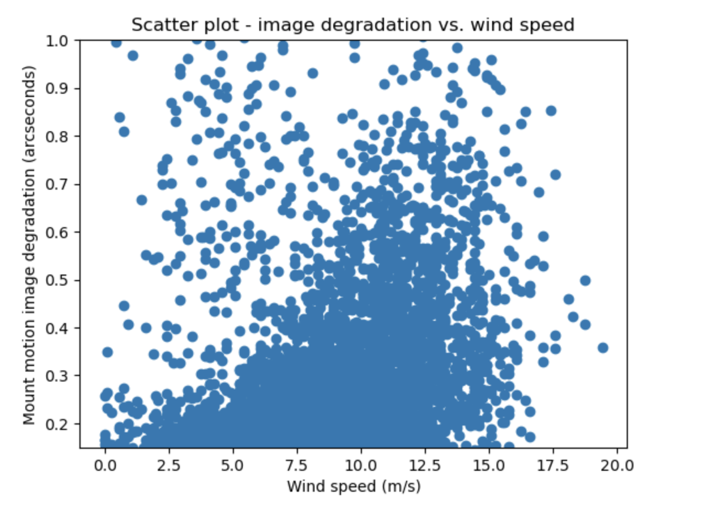
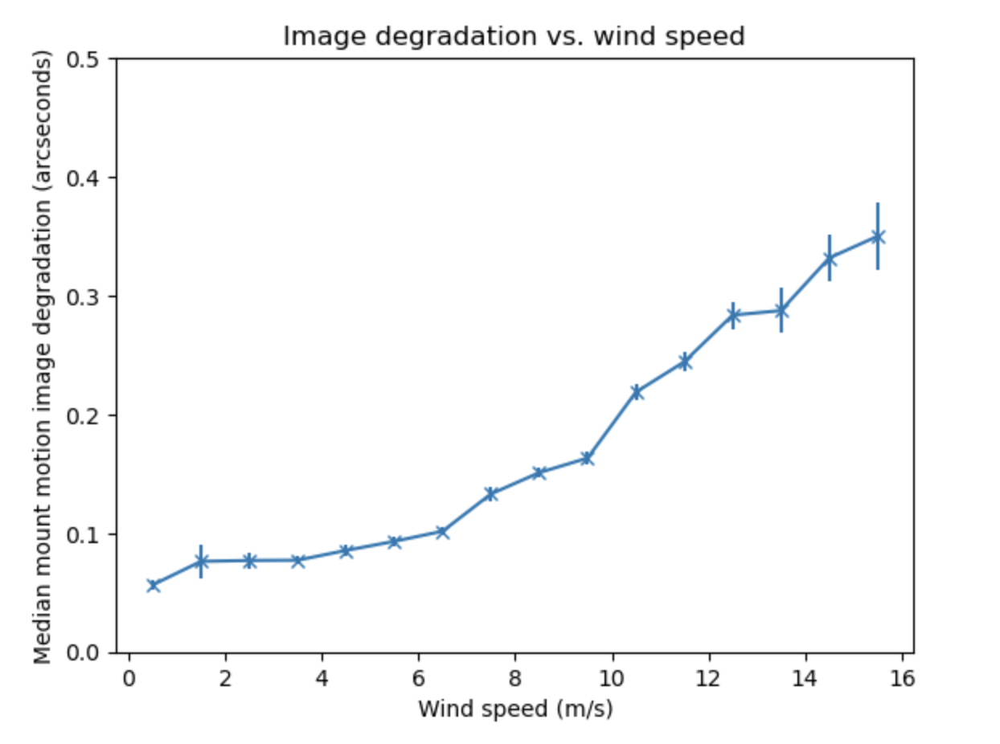
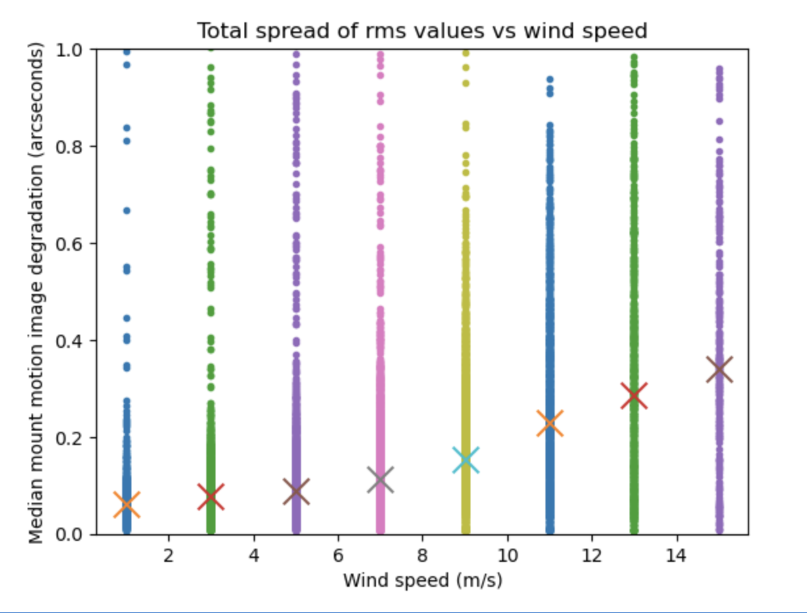
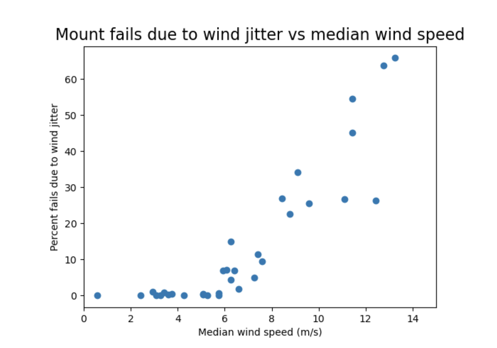
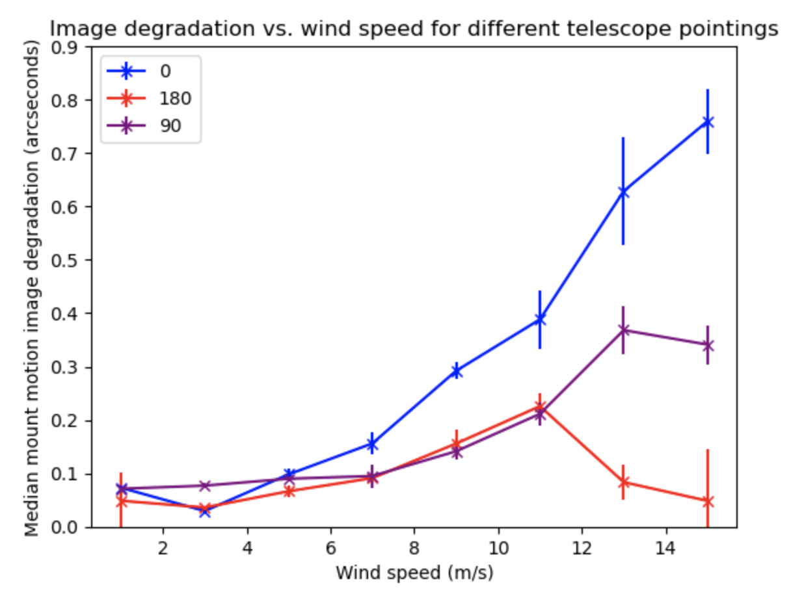
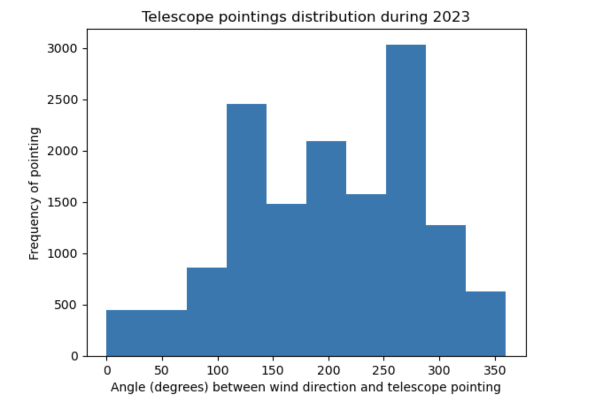
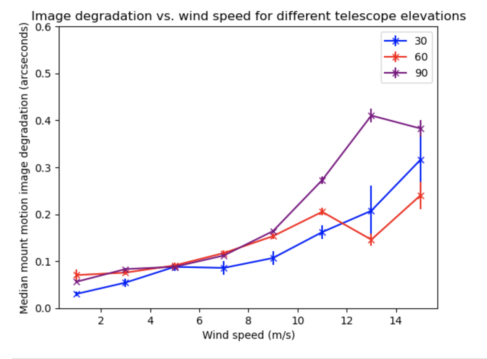

# AuxTel image quality wind study

## Abstract
We use all available wind speed and wind direction data from calendar year 2023 to map the effects of wind gusts on the mount errors of the Auxiliary Telescope (AuxTel). We show that when the average wind speed over a time span of 30 seconds exceeds 10 m/s, there is a clear effect on mount errors that translate into a degradation of image quality. We also demonstrate a clear azimuthal dependence of wind effects on the telescope, and highlight zones of avoidance to optimize observations during borderline windy conditions.

## Introduction
Operational weather limits are crucial to establish for the safety of the telescopes and instruments. Winds gusting towards the telescope can cause mount tracking errors, in addition to introducing dust, contaminants, and blowing around equipment inside the dome. Large mount errors in the presence of winds should result in closure of the dome to protect the equipment. We use the data here to define a wind speed limit to close AuxTel. As mount errors correlate strongly with image quality, we wish to explore conditions beneath the recommended operations wind limit and effectively decide in borderline conditions which portions of the skies can still be observed and at what telescope elevations. 

## Related tickets
- [SITCOM-1325](https://rubinobs.atlassian.net/browse/SITCOM-1325)
- [SITCOM-1196](https://rubinobs.atlassian.net/browse/SITCOM-1196)

## Execution details and data
We use the neural network described in [TN-125](https://sitcomtn-125.lsst.io/) to mine all mount tracking errors on AuxTel during 2023. The shape of the fast Fourier transform of the mount errors alludes to the cause of the mount error, and that drives the categorization of mount errors due to winds or due to various known (although not totally understood) technical issues. A separate notebook is used to generate the pickle file of all mount errors in 2023. The notebook here first simply reads in the file, picks out all mount errors due to wind, and then gathers telescope telemetry and wind speed data during the 30-second time span of the mount data collection. Wind speed data points are collected every 10 seconds. 

## Results
For the year 2023, we find over 14,000 wind data points, or over 4700 images that have mount error due to wind. In Fig. 1, we plot the raw data for image degradation vs wind speed over the entire year of 2023. For all data points with mount error above 0.15 arcseconds, as seen in the figure, a strong upward trend of mount error with wind speed is apparent, as the number of events of mount motion errors over 0.5 arcseconds roughly doubles when winds are over 9 m/s.

*Fig 1. All data from 2023, image degradation vs. wind speed.*

Fig 2 plots the median image degradation (mount rms error in arcseconds) vs wind speed. Between 10 and 12 m/s wind speeds, the median degradation creeps up to 0.2-0.3 arcseconds, impacting image science quality. 

*Fig 2. Median image degradation vs. wind speed.*

Fig. 3 shows the spread of mount errors per wind speed, which clearly shows an increase in the number of occurrences of mount errors over 0.6 arcseconds after only 7 m/s winds. 

*Fig 3. Spread of mount errors per integer wind speed.*

Finally, calling on a plot created in TN-125, we can show the percent of mount failures due to wind effects. As described in the document, a mount error over 0.25 arcseconds classifies a failure, noting that the telescope movement in arcseconds impacts the seeing in the image linearly, not in quadrature. As seen in Fig. 4, if wind speeds exceed 10 m/s, there is a 30% chance that the mount error will exceed 0.25 arcseconds, which. In the case of 1 arcsecond seeing, would increase the FWHM to 1.25 arcseconds. 

*Fig 4. Percent failures (rms above 0.25") vs. wind speed.*

10 m/s winds are clearly show that image quality is compromised, but imposing a closure limit in these conditions would result in a large impact on observing nights. We explore the effects of winds with respect to telescope elevation and azimuth so we can identify more opportunities to observe imaging targets in the presence of winds 10 m/s or greater. 

### Wind effects based on telescope azimuth
Fig. 5 bins telescope mount error by telescope pointing. In this scheme, we plot the angular difference between the telescope pointing and the dominant wind direction. An angle of 0 indicates that the telescope is pointing directly into the wind, and the data is plotting when events occur within +/- 10 degrees. 90 degrees indicates perpendicular pointing, and 180 degrees indicates that the telescope is facing opposite of the wind direction. As show in the plot, there is a lot of play in the telescope's azimuth in wind speeds greater than 10 m/s. We recommend that in when wind speeds exceed 10 m/s, the scheduler choose targets that are offset 180 degrees of the dominant wind direction. 

*Fig 5. Mount errors vs wind speed binned by telescope azimuth pointing.*

The majority of the nights, the dominant wind direction on Cerro Pachón is 330 - 350 degrees, coming from the northwest. Thermals from the Pacific Ocean blow up through the valley and across the foothills of the Andes. In the case of larger frontal systems from Argentina, the wind directions will change rapidly, likely affecting seeing strongly, so there is little chance that the conditions will be photometric in any case. 

During the year of 2023, we repeating many AuxTel observing campaigns, switching between repeating targets during observing nights through out the year. The distribution of telescope pointings during 2023 is plotted in Fig 6, which shows that the majority of observations were taking pointing between 60-90 degrees offset from the dominant direction of the wind. 

*Fig 6. Distribution of AuxTel azimuth pointing over the year 2023.*

### Wind effects based on telescope elevation
Fig. 7 shows that, as expected, winds affect AuxTel more strongly at higher telescope elevations. From 61 - 90 degrees elevation, in winds over 10 m/s, image quality degrades by more than 0.1 arcseconds more than at lower telescope elevations. In borderline conditions, target elevations should not exceed 60 degrees to ensure preserved image quality. 

*Fig 7. Mount errors vs wind speed binned by telescope elevation.*

## Conclusions
We recommend that when wind speeds exceed 10 m/s, the observing strategy should be modified to ensure that the telescope is pointing 180 degrees opposite of the dominant wind direction, and that target elevations do not exceed 60 degrees. In the case of 1.5" seeing, observers and strategy should adapt to ensure that rms error does not exceed 0.5" due to winds, which may dictate that even more conservative pointing are taken to preserve image quality. The plots indicate strongly that no counter measures can be taken to preserve image quality in the presence of wind speeds greater than 14 m/s over a 30 second person, so observers should close the dome and wait for conditions to improve in this case. Wind speeds greater than 14 m/s (or 50 km/hr) can endanger equipment safety, blow dust and objects around the dome, and do not show any added benefit to continuing observation. 

Although the telescope designs are very different, we aim to use a similar study to preserve Simonyi telescope image quality. While the Simonyi telescope will be much less susceptible to wind gusts due to its stout design, we hope to employ the same techniques modeled here as wind gusts across M1M3 to inform observing strategy in the presence of winds. 
